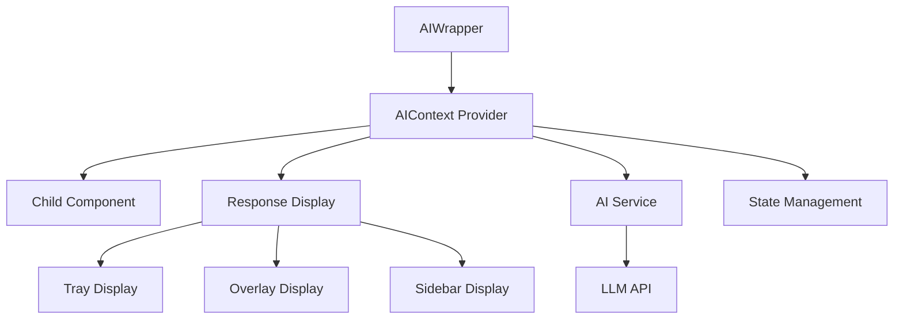
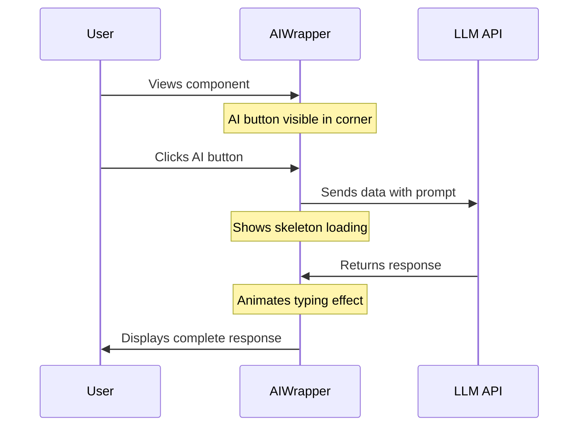

# AI Wrapper Component

This document outlines the design and implementation plan for the AIWrapper component, which enhances React components with AI capabilities.

## Overview

The AIWrapper is a higher-order component that wraps around any React component, extracts data from it, sends that data to an LLM with a prompt, and displays the response in various ways. This creates a seamless integration of AI capabilities into existing components.

## Core Architecture



## Component Structure

### 1. AIWrapper Component

```tsx
<AIWrapper
  displayMode="tray|overlay|sidebar"
  prompt="Your prompt template with {data} placeholders"
  dataSelector={(childData) => transformedData}
  apiConfig={{ endpoint, apiKey, model }}>
  <YourComponent data={someData} />
</AIWrapper>
```

### 2. AIContext

This will manage:

- AI interaction state (idle, loading, success, error)
- Response data
- Display state (open/closed)
- Configuration options

### 3. Display Components

- **Tray**: Slides up from the bottom of the child component
- **Overlay**: Covers the child component with a semi-transparent background
- **Sidebar**: Appears beside the child component

## Interaction Flow



## UI Components

### 1. AI Trigger Button

```tsx
<AITriggerButton position="top-right" onClick={handleAIRequest} isLoading={status === 'loading'} />
```

- Small square button (40px × 40px)
- Positioned absolutely in the top-right corner of the wrapped component
- Semi-transparent background that becomes opaque on hover
- AI-inspired icon (brain, sparkle, robot, etc.)
- Subtle pulse animation when idle to draw attention
- Transforms into a loading spinner when request is in progress

### 2. Loading Skeleton

```tsx
<AIResponseSkeleton lines={3} animated={true} />
```

- Appears immediately after button click
- Shows 3-5 lines of skeleton text (gray bars)
- Pulse animation to indicate loading
- Varies line lengths to look more natural
- Smooth transition when real content arrives

### 3. Typewriter Effect

```tsx
<TypewriterText
  text={aiResponse}
  speed={30} // ms per character
  cursor={true}
/>
```

- Simulates text being typed in real-time
- Adjustable speed (characters per second)
- Optional blinking cursor at the end
- Can be paused/resumed
- Supports rich text formatting (markdown, HTML)

## Implementation Details

### AIContext.tsx

```tsx
interface AIContextState {
  isOpen: boolean;
  status: 'idle' | 'loading' | 'success' | 'error';
  response: string | null;
  error: Error | null;
  config: {
    displayMode: 'tray' | 'overlay' | 'sidebar';
    prompt: string;
    apiConfig: {
      endpoint: string;
      apiKey: string;
      model: string;
    };
  };
}

interface AIContextValue extends AIContextState {
  toggle: () => void;
  processData: (data: any) => Promise<void>;
  reset: () => void;
}
```

### AIWrapper.tsx

```tsx
interface AIWrapperProps {
  children: ReactNode;
  displayMode: 'tray' | 'overlay' | 'sidebar';
  prompt: string;
  dataSelector: (data: any) => any;
  apiConfig: {
    endpoint: string;
    apiKey: string;
    model: string;
  };
  buttonPosition?: 'top-right' | 'top-left' | 'bottom-right' | 'bottom-left';
  typingSpeed?: number;
}

const AIWrapper: React.FC<AIWrapperProps> = ({
  children,
  displayMode = 'overlay',
  prompt,
  dataSelector,
  apiConfig,
  buttonPosition = 'top-right',
  typingSpeed = 30,
}) => {
  const [status, setStatus] = useState<'idle' | 'loading' | 'success' | 'error'>('idle');
  const [isOpen, setIsOpen] = useState(false);
  const [response, setResponse] = useState<string | null>(null);
  const childRef = useRef<HTMLDivElement>(null);

  const handleAIRequest = async () => {
    if (status === 'loading') return;

    setStatus('loading');
    setIsOpen(true);

    try {
      // Extract data from child component
      const childData = childRef.current ? extractData(childRef.current) : {};
      const processedData = dataSelector(childData);

      // Send to API
      const result = await sendToLLM(processedData, prompt, apiConfig);

      // Set response (will trigger typewriter effect)
      setResponse(result);
      setStatus('success');
    } catch (error) {
      setStatus('error');
      console.error('AI processing error:', error);
    }
  };

  return (
    <div className="ai-wrapper relative">
      <div ref={childRef}>{children}</div>

      <AITriggerButton
        position={buttonPosition}
        onClick={handleAIRequest}
        isLoading={status === 'loading'}
      />

      {isOpen && (
        <AIResponseDisplay
          mode={displayMode}
          status={status}
          response={response}
          typingSpeed={typingSpeed}
          onClose={() => setIsOpen(false)}
        />
      )}
    </div>
  );
};
```

### AI Button Component

```tsx
// Example using Heroicons
import { SparklesIcon } from '@heroicons/react/24/outline';

const AITriggerButton = ({ onClick, isLoading, position }) => {
  const positionClasses = {
    'top-right': 'top-2 right-2',
    'top-left': 'top-2 left-2',
    'bottom-right': 'bottom-2 right-2',
    'bottom-left': 'bottom-2 left-2',
  };

  return (
    <button
      className={`absolute ${positionClasses[position]} w-10 h-10 rounded-md bg-primary/10 hover:bg-primary/20 
                 transition-all duration-200 flex items-center justify-center`}
      onClick={onClick}>
      {isLoading ? (
        <LoadingSpinner className="w-5 h-5 text-primary" />
      ) : (
        <SparklesIcon className="w-5 h-5 text-primary" />
      )}
    </button>
  );
};
```

### Skeleton Loading Component

```tsx
const AIResponseSkeleton: React.FC<{ lines: number }> = ({ lines }) => {
  return (
    <div className="space-y-2 animate-pulse">
      {Array.from({ length: lines }).map((_, i) => (
        <div
          key={i}
          className="h-4 bg-muted rounded"
          style={{
            width: `${Math.floor(70 + Math.random() * 30)}%`,
            opacity: 1 - i * 0.1,
          }}
        />
      ))}
    </div>
  );
};
```

### Typewriter Effect Component

```tsx
const TypewriterText: React.FC<{ text: string; speed: number }> = ({ text, speed }) => {
  const [displayedText, setDisplayedText] = useState('');
  const [currentIndex, setCurrentIndex] = useState(0);

  useEffect(() => {
    if (!text || currentIndex >= text.length) return;

    const timer = setTimeout(() => {
      setDisplayedText((prev) => prev + text[currentIndex]);
      setCurrentIndex((prev) => prev + 1);
    }, speed);

    return () => clearTimeout(timer);
  }, [text, currentIndex, speed]);

  return (
    <div className="typewriter-text">
      {displayedText}
      {currentIndex < (text?.length || 0) && <span className="cursor animate-blink">|</span>}
    </div>
  );
};
```

## Display Modes

### 1. Overlay Mode

- Semi-transparent dark background (60-80% opacity)
- Blurs the child component underneath
- Centers the AI response with a clean card design
- Smooth fade-in animation
- Close button in the top-right corner
- Typewriter effect for the response text
- Skeleton loading while waiting

### 2. Tray Mode

- Slides up from the bottom of the component
- Partial height (30-50% of the component)
- Doesn't completely hide the child component
- Can be expanded to full height if needed
- Skeleton loading animation while waiting
- Typewriter effect for the response

### 3. Sidebar Mode

- Slides in from the right side
- Fixed width (300-400px)
- Full height of the component
- Can be collapsed/expanded
- Skeleton loading while waiting
- Typewriter effect for the response

## Technical Considerations

### Extracting Data from Child Component

This is tricky since React doesn't easily expose child component state. Options:

1. **Props-based**: Require the child component to expose data via props
2. **Context-based**: Use a context that both the child and AIWrapper can access
3. **Ref-based**: Use refs to access DOM elements (limited to visible content)
4. **Custom Hook**: Provide a hook that components can use to register their data

### Icon Libraries

We've decided to use:

1. **React Icons**: As our primary icon library for general UI elements
2. **Phosphor Icons**: Specifically for the AI button, using their beautiful AI-related icons

This combination gives us access to a wide variety of icons while ensuring our AI-specific elements have a distinctive and polished look.

### API Integration

We've decided to use an abstraction layer approach for API integration. This will:

1. **Abstract Provider Details**: Allow us to switch between different LLM providers (OpenAI, Anthropic, etc.)
2. **Standardize Requests/Responses**: Create a consistent interface regardless of the underlying API
3. **Handle Authentication**: Manage API keys and authentication in a centralized way
4. **Error Handling**: Provide consistent error handling across different providers

Implementation example:

```tsx
// src/services/ai-service.ts
export interface LLMRequest {
  prompt: string;
  data: any;
  model: string;
}

export interface LLMResponse {
  text: string;
  tokens: number;
  model: string;
}

export const sendToLLM = async (
  request: LLMRequest,
  apiConfig: { endpoint: string; apiKey: string }
): Promise<LLMResponse> => {
  // Implementation that can work with OpenAI, Anthropic, etc.
};
```

### Animation Strategy

We've decided on the following animation approach:

1. **Typewriter Effect**: Custom implementation for better control and performance
2. **Complex Animations**: Framer Motion for panel transitions, fades, and other complex animations
3. **Simple Animations**: Tailwind's built-in transition utilities for basic hover/focus effects

This hybrid approach gives us the best balance of performance, control, and developer experience.

## Implementation Phases

### Phase 1: Basic Structure

1. Create AIContext
2. Implement AIWrapper component
3. Create basic display components

### Phase 2: API Integration

1. Implement API service
2. Add error handling
3. Create loading states

### Phase 3: Display Modes

1. Implement tray display
2. Implement overlay display
3. Implement sidebar display

### Phase 4: Enhancements

1. Add animations
2. Improve styling
3. Add configuration options

## Example Usage

```tsx
// Example component with AI enhancement
<AIWrapper
  displayMode="overlay"
  prompt="Summarize this customer data: {data}"
  dataSelector={(data) => data.customerInfo}
  apiConfig={{
    endpoint: 'https://api.openai.com/v1/chat/completions',
    apiKey: process.env.OPENAI_API_KEY,
    model: 'gpt-4',
  }}>
  <CustomerProfile data={customerData} />
</AIWrapper>
```

## Next Steps

We've made several key decisions:

1. ✅ **Icon Libraries**: React Icons for general UI, Phosphor Icons for AI button
2. ✅ **API Integration**: Abstraction layer approach for flexibility
3. ✅ **Animation Strategy**: Custom typewriter effect + Framer Motion for complex animations
4. ✅ **Display Priority**: Overlay mode first, then tray and sidebar

Remaining tasks:

1. Create the basic AIWrapper component structure
2. Implement the abstraction layer for API integration
3. Build the UI components (button, skeleton, typewriter)
4. Implement the overlay display mode
5. Add the AIWrapper to the ComponentWrapper page for demonstration
6. Test with sample data and refine the implementation
