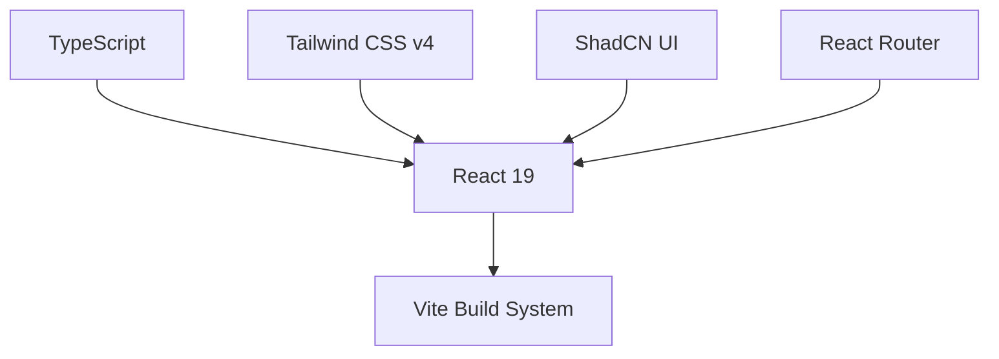
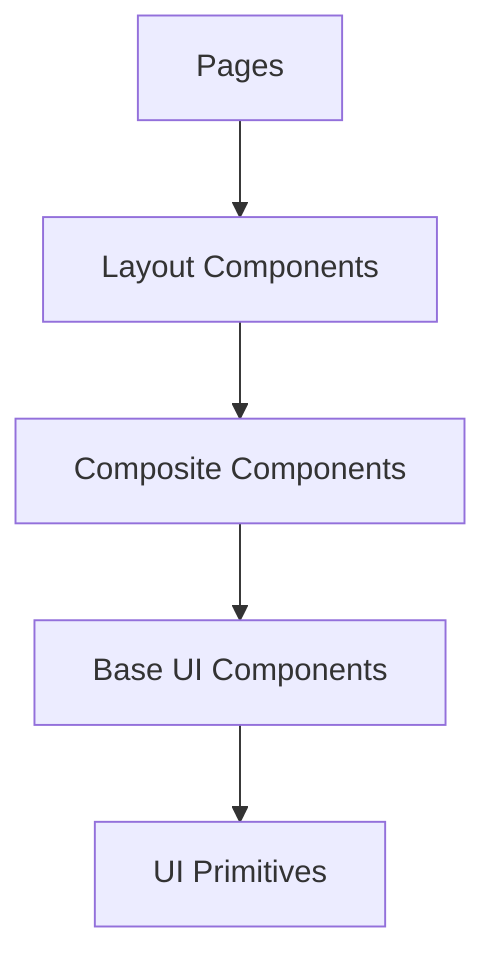

# System Patterns: React Playground

This document outlines the architectural patterns, design decisions, and system organization of the React Playground template.

## Architecture Overview

The React Playground is built on a modern frontend stack:



### Core Technologies

- **React 19**: Latest version with improved performance and new features
- **TypeScript**: For type safety and improved developer experience
- **Tailwind CSS v4**: Utility-first CSS framework for styling
- **ShadCN UI**: Accessible component library built on Tailwind
- **Vite**: Fast, modern build tool and development server
- **React Router**: For client-side routing

## Component Architecture

The component architecture follows a hierarchical pattern:



### Component Types

1. **UI Primitives**: Low-level components from ShadCN (buttons, inputs, etc.)
2. **Base UI Components**: Simple components composed of primitives (cards, modals, etc.)
3. **Composite Components**: Business-specific components combining multiple base components
4. **Layout Components**: Page structure components (header, footer, sidebar, etc.)
5. **Pages**: Full page components that combine layouts and composite components

## Directory Structure

```
src/
├── assets/            # Static assets (images, icons, etc.)
├── components/        # Reusable components
│   ├── ui/            # ShadCN UI components
│   └── [feature]/     # Feature-specific components
├── lib/               # Utility functions and helpers
├── pages/             # Page components
├── styles/            # Global styles and Tailwind configuration
└── main.tsx           # Application entry point
```

## State Management

The React Playground uses a simple and pragmatic approach to state management:

1. **Component State**: Local state using React's `useState` and `useReducer` hooks
2. **Context API**: For sharing state between related components
3. **URL State**: Using React Router for navigation state

For more complex prototypes, developers can add state management libraries as needed.

## Styling Approach

The styling system is built on Tailwind CSS v4 with a few key patterns:

1. **Utility-First**: Using Tailwind's utility classes for most styling needs
2. **Component Variants**: Using the `cva` (class-variance-authority) pattern for component variants
3. **CSS Variables**: For theme values and design tokens
4. **Global Styles**: Minimal global styles defined in `globals.css`

### Theme Configuration

The theme is configured in `tailwind.config.js` and uses CSS variables for key design tokens:

```css
:root {
  --background: 0 0% 100%;
  --foreground: 222.2 84% 4.9%;
  --primary: 222.2 47.4% 11.2%;
  /* Additional design tokens */
}
```

## Routing Pattern

Routing is implemented using React Router with a simple configuration:

```tsx
<Router>
  <Routes>
    <Route path="/" element={<Main />} />
    <Route path="/component-wrapper" element={<ComponentWrapper />} />
    {/* Additional routes */}
  </Routes>
</Router>
```

## Data Fetching

For prototypes that need to fetch data, we recommend:

1. **React Query**: For data fetching, caching, and state management
2. **Fetch API**: For simple data fetching needs
3. **Mock Data**: Local JSON files for quick prototyping without a backend

## Accessibility Patterns

Accessibility is built into the system through:

1. **ShadCN Components**: Pre-built with accessibility in mind
2. **Semantic HTML**: Using the correct HTML elements for their intended purpose
3. **ARIA Attributes**: When necessary to enhance accessibility
4. **Keyboard Navigation**: Ensuring all interactive elements are keyboard accessible

## Performance Considerations

While performance optimization isn't the primary focus of prototyping, the template includes:

1. **Code Splitting**: Through React's lazy loading
2. **Vite Optimizations**: Fast builds and hot module replacement
3. **Tailwind's JIT Compiler**: For optimized CSS output

## Testing Strategy

For prototypes that require testing:

1. **Component Testing**: Using Vitest and React Testing Library
2. **Visual Testing**: Using Storybook (optional add-on)
3. **End-to-End Testing**: Using Playwright (optional add-on)

## Design-to-Code Workflow

The recommended workflow for turning designs into prototypes:

1. Start with page layouts and navigation
2. Implement core UI components using ShadCN
3. Build feature-specific composite components
4. Connect components with state and interactions
5. Refine styling and animations

This system architecture provides a solid foundation for rapid prototyping while maintaining good practices that can transition to production code when needed.
